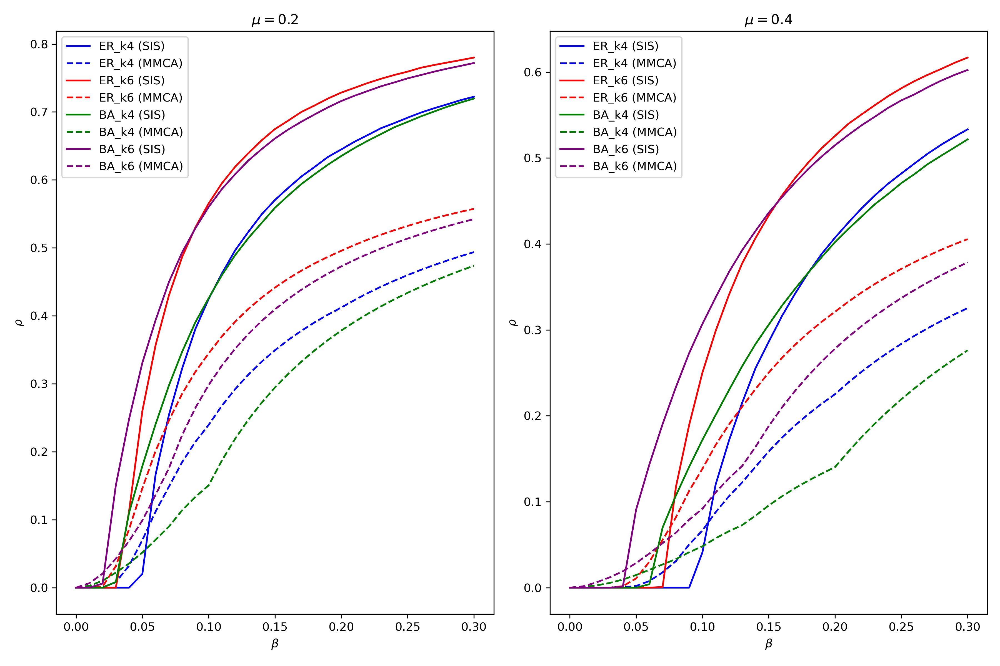

# ComplexNets-A3-SISModel

## Monte Carlo Simulation of Epidemic Spreading on Complex Networks

This repository contains a full pipeline for simulating and analyzing the dynamics of an epidemic spread using the **Susceptible-Infected-Susceptible (SIS)** model on complex networks, via Monte Carlo simulations. The model assumes discrete-time steps and network-based propagation of infection.

The simulations are implemented in a single Jupyter Notebook: `ComplexNets-A3-SISModel.ipynb`, and utilize real network data stored in the `data/` directory.

---

## :microscope: Objective

To investigate the behavior of the average fraction of infected individuals $\langle \rho \rangle$ in the stationary state, as a function of the infection probability $ \lambda $, across different types of networks and recovery probabilities $ \mu $.

---

## :triangular_ruler: Model Description

The SIS model considers each node as an individual that can be in one of two states:
- **Susceptible (S):** Healthy, but can become infected.
- **Infected (I):** Currently infected and can transmit the infection.

At each time step:
1. **Infected nodes** recover with probability $ \mu $.
2. **Susceptible nodes** can become infected by their infected neighbors with probability $ \beta $ (i.e., $ \lambda $).

The system is evolved until a stationary regime is reached, from which $ \langle \rho \rangle $ is computed.

---

## :file_folder: Directory Structure

```
ComplexNets-A3-SISModel/
├── nets/
│   ├── ER_k4.net                  # Erdős-Rényi network with <k>=4
│   ├── ER_k6.net                  # Erdős-Rényi network with <k>=6
│   ├── BA_k4.net                  # Barabási-Albert network with <k>=4
│   └── BA_k6.net                  # Barabási-Albert network with <k>=6
└── ComplexNets-A3-SISModel.ipynb  # Main simulation notebook
```

---

## :gear: Simulation Parameters

| Parameter       | Description                                 | Value(s)                                  |
|-----------------|---------------------------------------------|-------------------------------------------|
| $` \lambda `$   | Infection probability                       | From 0 to 0.3 ($` \Delta \lambda = 0.01 `$) |
| $` \mu `$       | Recovery probability                        | 0.2 and 0.4                               |
| $` N `$         | Number of nodes per network                 | 1000                                      |
| $` \rho(0) `$   | Initial infected fraction                   | 0.2                                       |
| $` T_{max} `$   | Total time steps per simulation             | 1000                                      |
| $` T_{trans} `$ | Transient period before stationary state    | 900                                       |
| $` N_{rep} `$   | Number of independent repetitions           | 100 (or 50 if needed)                     |

---

## :bar_chart: Outputs

- Epidemic diagrams $ \langle \rho \rangle (\lambda) $ for each network and $ \mu $.
- Comparative plots showing the different epidemic thresholds and behaviors between ER and BA networks.
- Optional comparison with theoretical predictions via the **Microscopic Markov Chain Approach (MMCA)**.

---

## :page_facing_up: Report (included in PDF form)

The accompanying report includes:
- Methodological choices and software details.
- All epidemic diagrams with clear indication of parameters.
- Comparative analysis of ER vs BA network spreading behavior.

---

## :bookmark_tabs: Key Notes

- The code is optimized for educational clarity, not performance. For large-scale simulations, consider reimplementing in a compiled language.
- Ensure you visualize $ \rho(t) $ vs time to confirm that stationarity is achieved before calculating $ \langle \rho \rangle $.
- The network files are in `.net` format compatible with NetworkX parsing utilities.

---

## :trophy: For Maximum Grade

> Comparison of Monte Carlo simulations with MMCA theoretical predictions is included.

  

---

## :page_with_curl: License

MIT License. Feel free to use and adapt the code for academic purposes.

---

Enjoy exploring epidemic dynamics on networks!
